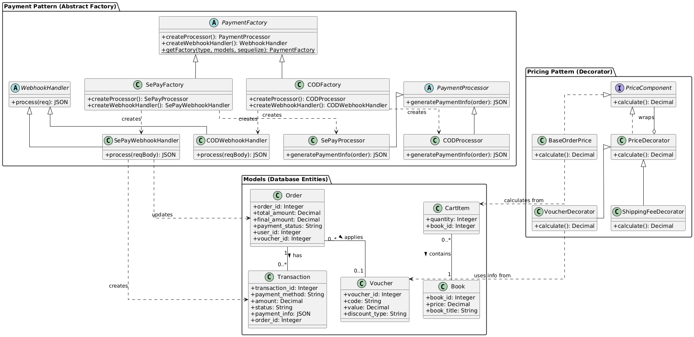
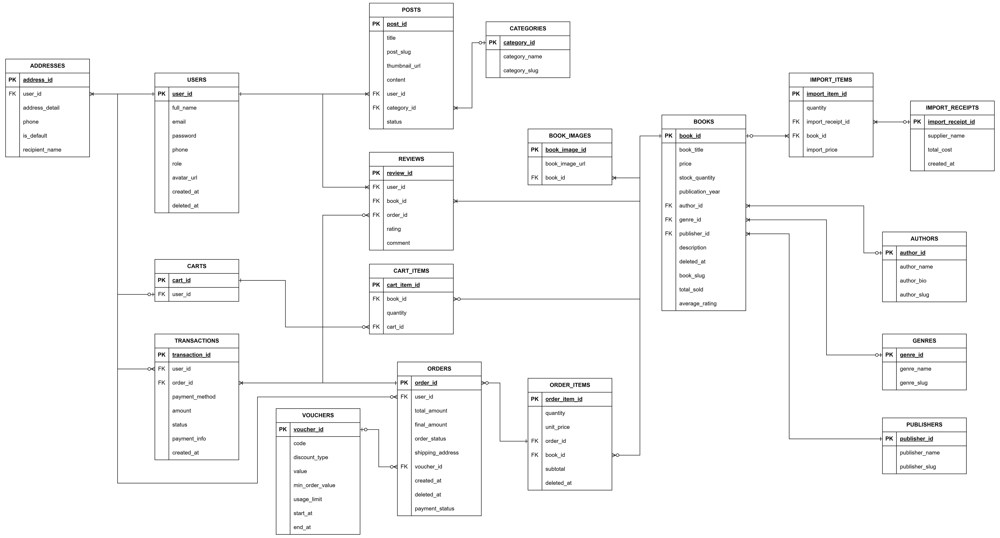
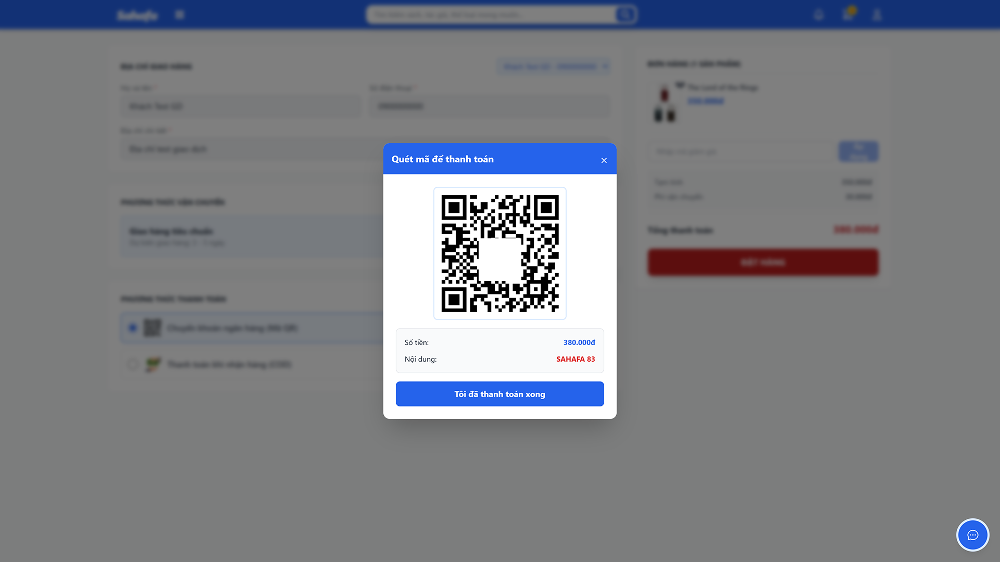

# Sahafa BookStore - E-Commerce Platform

E-commerce website for selling books built with Vue 3, Express.js, MySQL, featuring an Admin Dashboard and AI Chatbot.

---

## Project Motivation

### Practical
- **Digital Transformation**: Solves the inefficiencies of manual book management, optimizing operations, reducing errors, and saving time.
- **Business Growth**: Provides a new digital channel for small and medium-sized bookstores to reach a wider audience.

### Educational
- **Design Patterns**: Practical application of software design patterns (Factory, Decorator, etc.) in a real-world context.
- **Modern Tech Stack**: Hands-on experience with modern web technologies (Vue 3, Node.js) and DevOps tools (Docker, CI/CD).
- **Professional Development**: Exposure to the full software development lifecycle, from architecture to deployment.

---

## Team & Task Assignment

| Member Name | Student Code | Assigned Task |
|-------------|--------------|---------------|
| [**Phùng Mạnh Dũng**](https://github.com/dungcan2k5) | A47781 | Backend, Payment Factory Pattern, Deploy (CI/CD), Composite Pattern |
| [Phạm Văn Khải](https://github.com/Khaipamh) | A47170 | User (Frontend), Voucher, Payment, Cart (Backend), Payment Factory Pattern, Composite Pattern |
| [Nguyễn Tiến Dũng](https://github.com/nguyendung1922005) | A47114 | Book (Frontend), Pricing Decorator Patter, CoCoMo, Document |
| [Nghiêm Đức Anh](https://github.com/demsus31) | A48415 | Admin (Frontend), Pricing Decorator Pattern, CoCoMo |


## Class Diagram



## Entity Relationship Diagram



---

## Data Flow


---


## Core Features & Demo

### User Storefront


*Home Page Overview*


*Payment Integration via QR Code*

- Browse books by category, search functionality.
- View book details (ratings, reviews, authors, price).
- Cart management (add, update, remove items).
- Payment via QR code (Sepay).
- User registration/login, account management.
- Order history and status tracking.
- Write reviews and rate books.

### AI Chatbot


*AI Chatbot Interaction Demo*

- AI Chatbot for book recommendations and customer support.

### Admin Dashboard

<!-- TODO: [Must Have] Insert screenshot of the Admin Dashboard here -->

*Admin Dashboard Overview*

- Book management (CRUD, cover image upload).
- Category and supplier management.
- Order management (view details, update status).
- User management (CRUD, roles).
- Staff management (permissions).
- Statistics and analysis (revenue, top books, customer insights).
- Export reports (PDF, Print).
- Audit logs (change history).

---

## Technical Highlights

### Payment Integration
- **Gateway**: **SePay** (VietQR).
- **Mechanism**: **Webhook**.
    - The system uses a **Factory Pattern** (`PaymentFactory`) to handle payment processing strategies.
    - Payments are confirmed automatically in real-time via the `/api/payment/sepay-webhook` endpoint.
    - Eliminates the need for manual confirmation or polling, ensuring a seamless user experience.

### AI Chatbot
- **Model**: **Google Gemini 2.5 Flash**.
- **Implementation**:
    - Integrated directly into the Node.js backend using `@google/genai`.
    - **Persona**: Configured via System Instructions to act as a friendly "Gen Z" staff member.
    - **Capabilities**: Provides personalized book recommendations, answers shipping queries (e.g., free shipping threshold), and assists with general support.

### Security
- **Authentication**: **JWT (JSON Web Tokens)** for secure, stateless user sessions.
- **Password Protection**: **BCrypt** hashing with salt to ensure user passwords are never stored in plain text.
- **Access Control**: Middleware-based role management ensuring strict separation between User and Admin privileges.

---

## Tech Stack

### Frontend
- Vue 3 - Progressive JavaScript framework.
- Vite - Next generation frontend tooling.
- Pinia - State management.
- Vue Router - Client-side routing.
- Axios - HTTP client.
- Tailwind CSS - User storefront styling.
- Element Plus - Admin dashboard UI components.
- Chart.js - Data visualization.

### Backend
- Node.js + Express - Server framework.
- Sequelize - ORM (MySQL).
- JWT - Authentication (jsonwebtoken).
- bcryptjs - Password hashing.
- Joi - Input validation.
- Multer - File upload (book covers).
- Helmet - Security headers.
- CORS - Cross-origin resource sharing.

### Database
- SQLite3 (Development) / MySQL (Production).
- Relational schema with proper indexing.
- Migrations managed by Sequelize.

### DevOps & Deployment
- Docker & Docker Compose - Containerization.
- GitHub Actions - CI/CD pipeline.
- Nginx - Reverse proxy & web server.
- Cloudflare - DNS & DDoS protection.

---

## Project Structure
```
SahafaBookStore/
├── backend/                 # Express.js API server
│   ├── src/
│   │   ├── config/         # Database, constants, swagger
│   │   ├── controllers/    # Business logic
│   │   ├── models/         # Sequelize ORM models
│   │   ├── routes/         # API endpoints
│   │   ├── middleware/     # Auth, validation, error handling
│   │   ├── app.js          # Express app setup
│   │   └── seed.js         # Database seeder
│   ├── uploads/            # Book cover images
│   ├── Dockerfile
│   └── package.json
│
├── frontend/               # Vue 3 + Vite
│   ├── src/
│   │   ├── components/     # Reusable Vue components
│   │   ├── pages/          # Route pages (Home, Cart, Admin, etc)
│   │   ├── stores/         # Pinia state management
│   │   ├── router/         # Vue Router config
│   │   ├── services/       # API services (Axios)
│   │   ├── layouts/        # Page layouts
│   │   ├── App.vue
│   │   └── main.js
│   ├── public/             # Static assets
│   ├── package.json
│   ├── vite.config.js
│   ├── tailwind.config.js
│   └── Dockerfile
│
├── docker-compose.yml      # Multi-container setup
├── .github/
│   └── workflows/          # CI/CD workflows
├── INSTRUCTIONS.md         # Detailed development guide
└── README.md              # This file
```
---

## Quick Start

### Prerequisites
- **For Docker:** Docker & Docker Compose.
- **For Local:** Node.js 18+, MySQL/SQLite.
- Git.

### Option 1: Running with Docker (Recommended)
Fastest way to get the project up and running without installing dependencies manually.

1. **Clone the Repository**
```bash
git clone https://github.com/dungcan2k5/SahafaBookStore.git
cd SahafaBookStore
```

2. **Setup Environment Variables**
```bash
# Backend
cd backend
cp .env.example .env
# Edit .env if necessary (DB configs are pre-set for Docker)

# Frontend
cd ../frontend
cp .env.example .env
```

3. **Start the Application**
```bash
cd ..  # Back to root
docker-compose up --build
```
The app will be available at:
- **Frontend**: http://localhost:5173
- **Backend API**: http://localhost:3000
- **Nginx**: http://localhost:80

---

### Option 2: Running Locally (Manual Setup)
Suitable for development or if you don't use Docker.

1. **Clone & Install Dependencies**
```bash
git clone https://github.com/dungcan2k5/SahafaBookStore.git
cd SahafaBookStore

# Backend
cd backend
cp .env.example .env
npm install

# Frontend
cd ../frontend
cp .env.example .env
npm install
```

2. **Database Setup**
Ensure your MySQL server is running and updated in `backend/.env`.
```bash
cd backend
# Run migrations
npm run migrate
# Seed initial data
npm run seed
```

3. **Run Services**
Open two terminal tabs:

**Terminal 1 (Backend):**
```bash
cd backend
npm run dev
```

**Terminal 2 (Frontend):**
```bash
cd frontend
npm run dev
```

---

## API Documentation

Base URL
- Local: http://localhost:3000/api/docs
- Production: https://sahafa.dungcan.id.vn/api/docs

Authentication
Authorization: Bearer <JWT_TOKEN>

See the /api/docs endpoint on the running backend for full Swagger documentation.

---

## License

MIT License